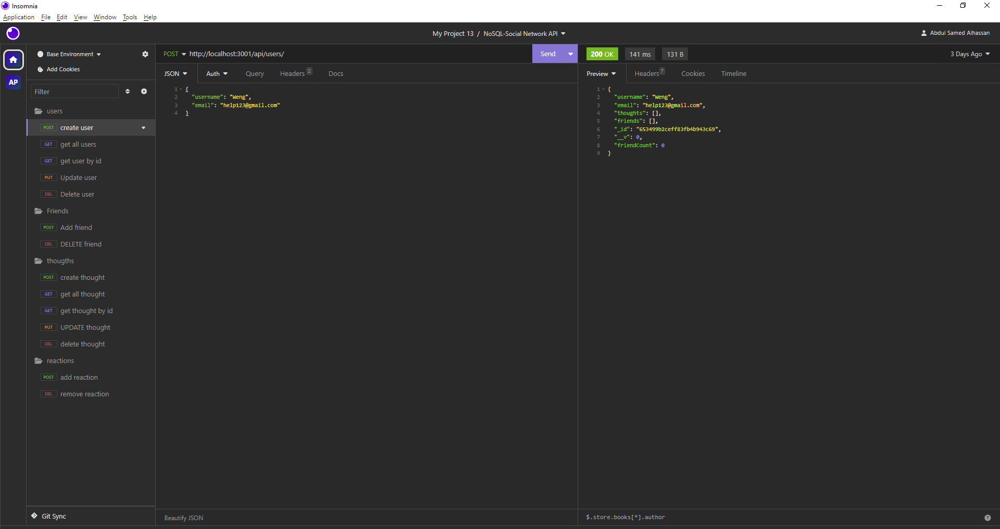
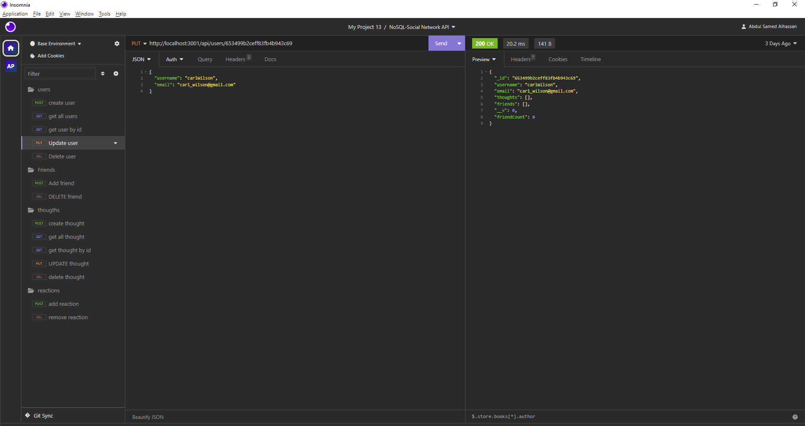
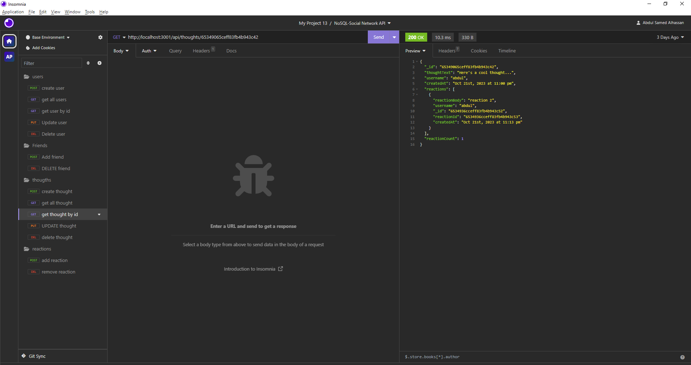
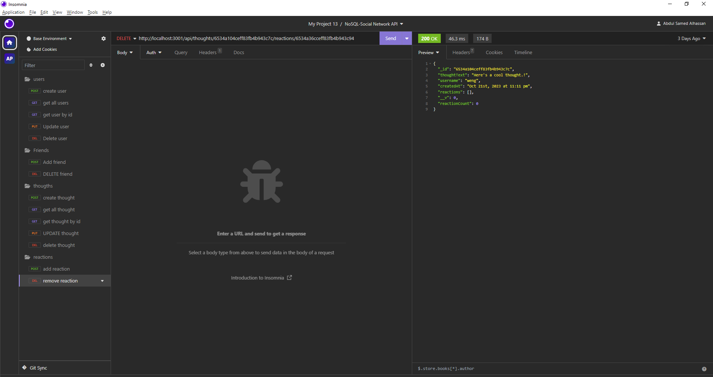
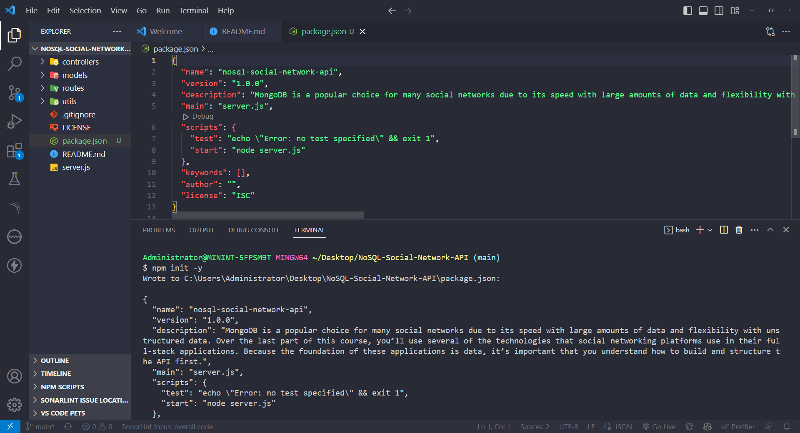
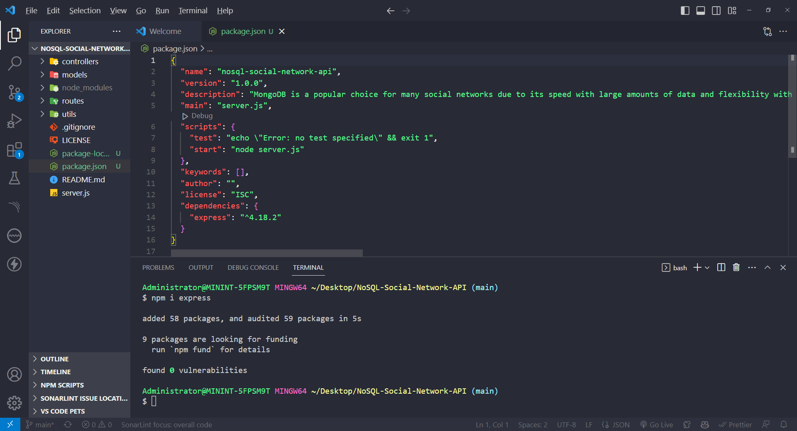
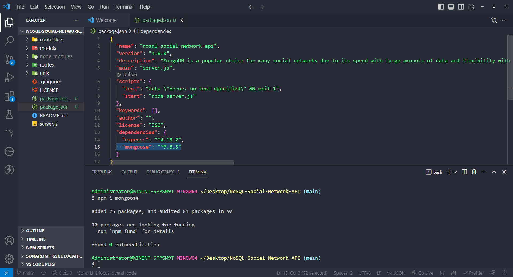

# Social Network API with NoSQL Database

## Table of Contents
- [Overview](#overview)
- [User Story](#user-story)
- [Features](#features)
  - [Database Configuration](#database-configuration)
  - [Database Initialization](#database-initialization)
  - [Server Initialization](#server-initialization)
  - [API Endpoints](#api-endpoints)
  - [CRUD Operations](#crud-operations)
- [Getting Started](#getting-started)
- [Usage](#usage)
- [Technologies Used](#technologies-used)
- [License](#license)
- [Acknowledgments](#acknowledgments)
- [Walkthrough Video](#walkthrough-video)
- [Questions](#questions)
- [Contribution](#contribution)

## Overview

This is a social media API built with a NoSQL database. It allows you to manage users, thoughts, reactions, and friendships in a social network setting. This API is designed to handle large amounts of unstructured data.

## User Story

As a social media startup, I want an API for my social network that uses a NoSQL database so that my website can handle large amounts of unstructured data.

## Features
- Create, update, and delete users and thoughts.
- Add and remove friends to a user's friend list.
- Create and delete reactions to thoughts.
- JSON-formatted data responses.
- Scalable NoSQL database support.










### Database Configuration

The application is configured to use MongoDB, a NoSQL database, to store and manage data efficiently.

### Database Initialization

The Mongoose models are synchronized with the MongoDB database to ensure data integrity and consistency.

### Server Initialization

The application runs an Express.js server to handle incoming API requests.

### API Endpoints

The API provides various endpoints to perform CRUD operations on users, thoughts, reactions, and friendships.

### CRUD Operations

- Users: Create, Read, Update, and Delete users.
- Thoughts: Create, Read, Update, and Delete thoughts.
- Reactions: Add and Remove reactions to thoughts.
- Friendships: Add and Remove friends from a user's friend list.

## Getting Started

1. Clone the repository:

   ```shell
   git clone https://github.com/abdulsamedtma/NoSQL-Social-Network-API
   ```

2. Navigate to the project directory:

   ```shell
   cd nosql-social-network-api
   ```

3. Install dependencies:

   ```shell
   npm install
   ```

4. Start the server:

   ```shell
   npm start
   ```

The API will be accessible at `http://localhost:3001`.

## Usage

You can use tools like [Insomnia](https://insomnia.rest/) to test and interact with the API endpoints.

## Technologies Used

- Node.js
- Express.js
- MongoDB
- Mongoose







## License

This project is licensed under the MIT License - see the [LICENSE](LICENSE) file for details.

## Acknowledgments

Thanks to my tutor for explaining some concepts that enhanced my understanding and helped me work smarter.

## Walkthrough Video

To see this application in action, please check out our [Walkthrough Video]() that demonstrates the functionality and showcases how it meets all the acceptance criteria.

## Questions

Have additional questions? Click the links below to reach me through my GitHub account or Email address.

- [Link to Github](https://github.com/abdulsamedtma)
- [Connect with Abdul via Email](mailto:abdulsamedtma@gmail.com)

## Contribution

If you'd like to contribute to this project, feel free to fork the repository and submit a pull request. Your contributions are greatly appreciated.

Click: [Repository URL](https://github.com/abdulsamedtma/NoSQL-Social-Network-API)

   This Social Network API with NoSQL Database was created with ❤️ by Abdul. ✨  Every day is a learning day!  ✨

